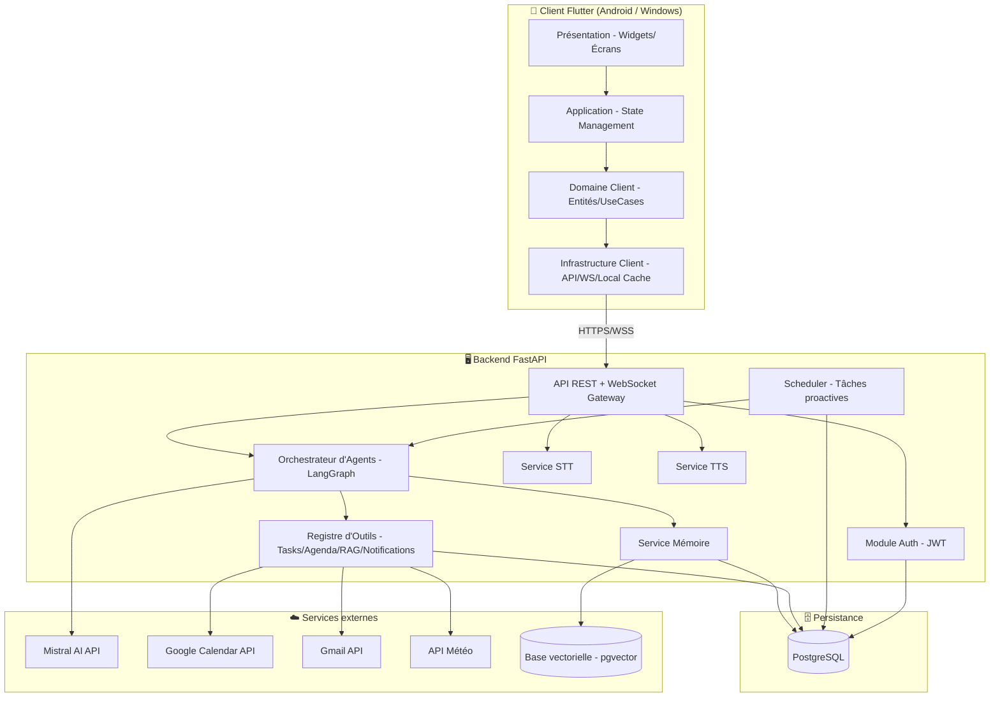
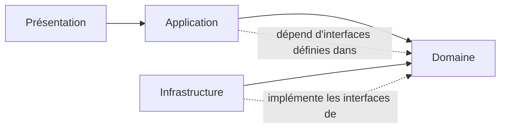
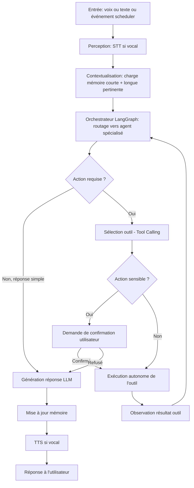
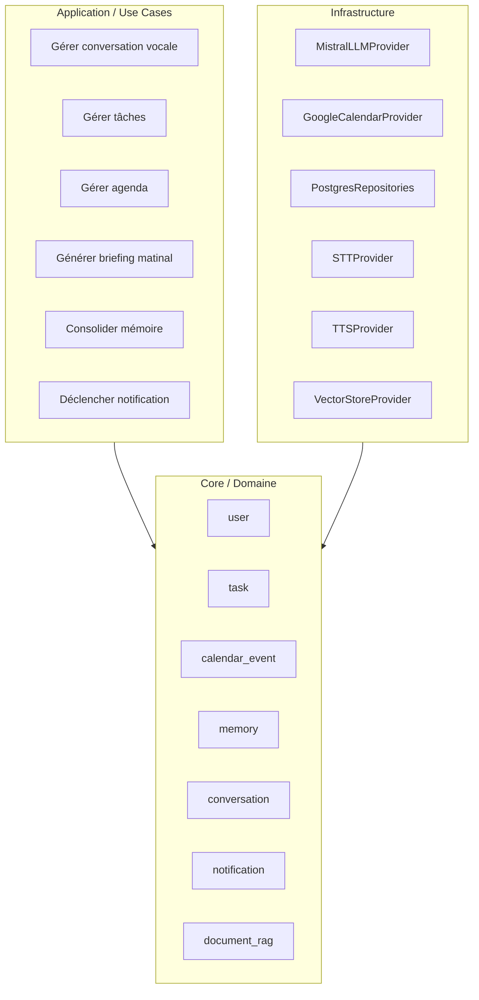
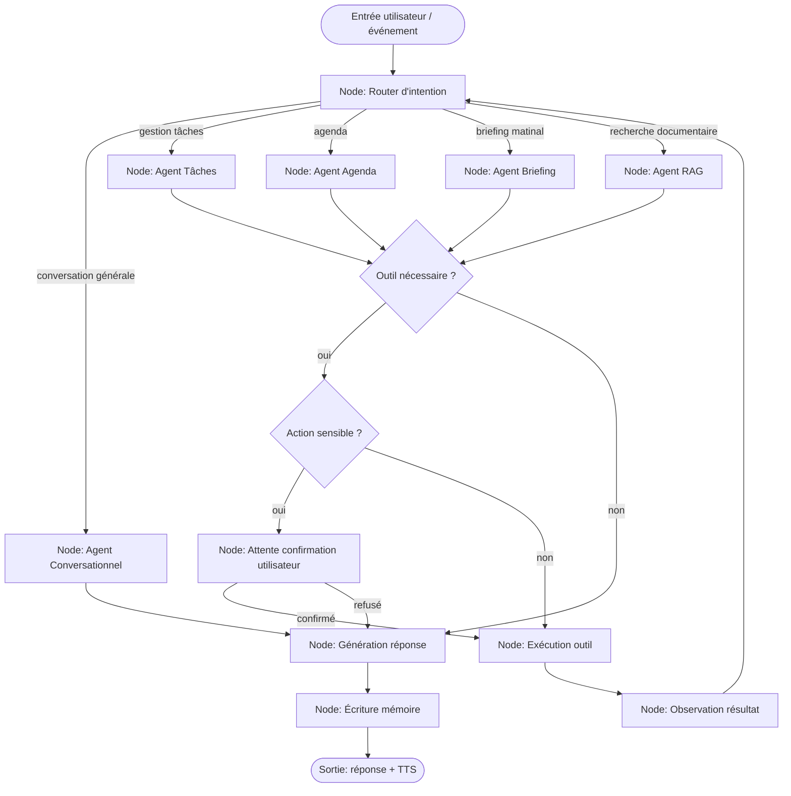
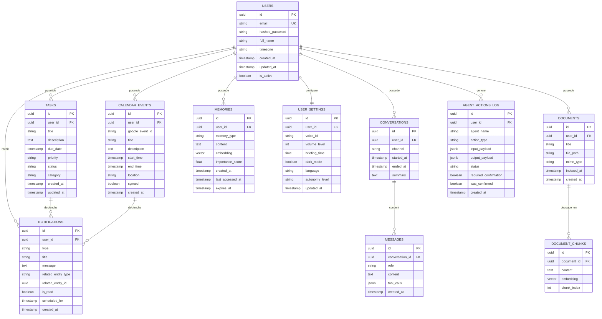
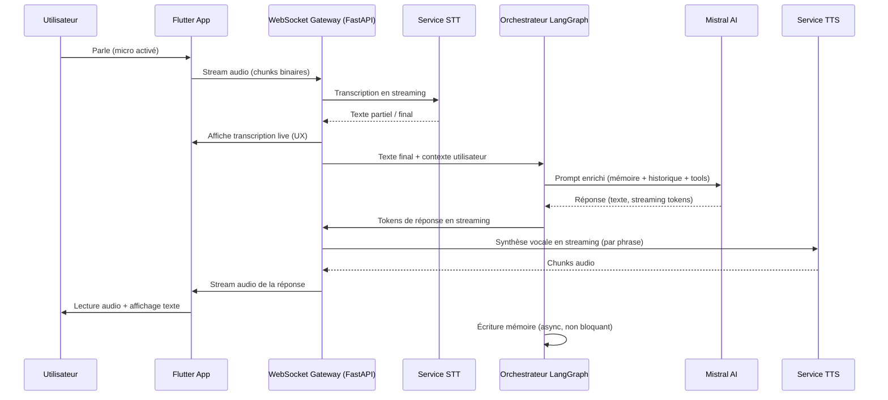

# W4FO — Assistant IA Personnel de Nouvelle Génération
## Document d'Architecture Logicielle

**Version du document :** 1.0
**Statut :** Proposition pour validation
**Auteur :** Architecture proposée par Claude (Anthropic), en tant que Software Architect Senior

---

## Table des matières

1. [Analyse du projet](#1-analyse-du-projet)
2. [Vision produit et principes directeurs](#2-vision-produit-et-principes-directeurs)
3. [Architecture globale](#3-architecture-globale)
4. [Choix technologiques justifiés](#4-choix-technologiques-justifiés)
5. [Découpage en modules](#5-découpage-en-modules)
6. [Architecture des agents IA (LangGraph)](#6-architecture-des-agents-ia-langgraph)
7. [Schéma de base de données PostgreSQL](#7-schéma-de-base-de-données-postgresql)
8. [Structure des dossiers Backend (Python)](#8-structure-des-dossiers-backend-python)
9. [Structure des dossiers Frontend (Flutter)](#9-structure-des-dossiers-frontend-flutter)
10. [Flux vocal temps réel](#10-flux-vocal-temps-réel)
11. [Sécurité et authentification](#11-sécurité-et-authentification)
12. [Roadmap de développement](#12-roadmap-de-développement)
13. [Risques techniques et mitigation](#13-risques-techniques-et-mitigation)
14. [Annexes](#14-annexes)

---

## 1. Analyse du projet

### 1.1 Nature du projet

W4FO n'est pas un chatbot à requête-réponse. C'est un **système multi-agent orchestré**, avec :

- une **couche de perception** (voix → texte, texte → voix),
- une **couche de mémoire** (court terme, long terme, épisodique, sémantique),
- une **couche de raisonnement** (LLM + agents spécialisés via LangGraph),
- une **couche d'action** (outils : calendrier, tâches, notifications, recherche documentaire),
- une **couche de présentation** (Flutter, multi-plateforme).

Le point critique de conception est que **le raisonnement et l'action doivent être découplés de l'interface** : le backend doit pouvoir fonctionner de façon autonome (ex. réveil intelligent déclenché par un scheduler serveur), pas uniquement en réaction à une requête utilisateur.

### 1.2 Contraintes fonctionnelles clés

| Contrainte | Implication architecturale |
|---|---|
| Conversation vocale fluide et temps réel | WebSocket bidirectionnel, streaming LLM, TTS en streaming |
| Autonomie (réveil, rappels, alertes) | Scheduler côté serveur + agents proactifs, indépendants de l'app ouverte |
| Mémoire longue durée | Base vectorielle + PostgreSQL relationnel, stratégie de résumé/consolidation |
| Multi-plateforme (Android puis Windows) | Flutter avec séparation stricte UI / logique métier |
| RAG futur | Architecture d'outils (tools) extensible dès le V1, RAG branché en V3 |
| Contrôle utilisateur sur l'autonomie | Système de permissions et de validation d'actions sensibles |

### 1.3 Ce qui différencie ce projet d'un chatbot classique

Un chatbot répond. W4FO **observe, décide, agit, puis rend compte**. Cela impose :

- une boucle agentique (perception → mémoire → planification → action → réflexion),
- une **traçabilité** des décisions prises de manière autonome (audit trail),
- une distinction entre actions "safe" (auto-exécutées) et actions "sensibles" (nécessitant confirmation utilisateur).

---

## 2. Vision produit et principes directeurs

1. **Local-first control, cloud-powered intelligence** : l'utilisateur garde la main ; le LLM propose, l'utilisateur (ou des règles) dispose.
2. **Extensibilité par les outils (tools)** : chaque nouvelle capacité (Gmail, RAG, domotique...) s'ajoute comme un "tool" LangGraph sans toucher au cœur du système.
3. **Mémoire comme produit, pas comme détail technique** : la qualité perçue de W4FO dépendra à 80% de la qualité de sa mémoire.
4. **Dégradation gracieuse** : si Mistral API est indisponible, ou si le micro échoue, l'app doit rester utilisable en mode texte / mode dégradé.
5. **Séparation stricte Clean Architecture** : aucune dépendance du domaine métier vers Flutter, FastAPI, SQLAlchemy ou Mistral SDK.

---

## 3. Architecture globale

### 3.1 Vue d'ensemble



### 3.2 Principe de la Clean Architecture appliquée



**Règle d'or : les flèches de dépendance pointent toujours vers le Domaine.** Le Domaine ne connaît ni FastAPI, ni SQLAlchemy, ni Flutter, ni Mistral. Il ne connaît que des interfaces (ports) que l'Infrastructure implémente (adapters). C'est une architecture hexagonale (Ports & Adapters) combinée à la Clean Architecture.

Cela signifie concrètement :
- Le Domaine définit `interface LLMProvider` → Infrastructure implémente `MistralLLMProvider`.
- Le Domaine définit `interface CalendarProvider` → Infrastructure implémente `GoogleCalendarProvider`.
- Demain, remplacer Mistral par un autre LLM ne touche à aucune ligne de logique métier.

### 3.3 Vue "boucle agentique" (le cœur du système)



---

## 4. Choix technologiques justifiés

| Techno | Rôle | Justification |
|---|---|---|
| **Flutter** | Frontend Android + Windows | Un seul codebase UI pour les deux cibles imposées, excellent support audio temps réel via plugins natifs |
| **FastAPI** | Backend API | Async natif (critique pour le streaming LLM/voix), typage Pydantic, performance, écosystème Python = accès direct à LangGraph |
| **PostgreSQL** | Base relationnelle | Fiabilité transactionnelle pour tâches/agenda/utilisateurs ; extension **pgvector** permet d'unifier mémoire relationnelle et mémoire sémantique dans un seul SGBD (évite d'ajouter un store vectoriel séparé en V1) |
| **Mistral AI API** | LLM de raisonnement | Imposé ; bon support function calling / tool use, latence correcte pour usage vocal, modèles disponibles en France/UE (pertinent si contraintes RGPD) |
| **LangGraph** | Orchestration d'agents | Modélise la boucle agentique comme un graphe d'états explicite (contrôle, boucles, reprises sur erreur), bien plus adapté qu'un simple enchaînement de prompts pour un système à actions autonomes |
| **JWT** | Authentification | Stateless, adapté à un client mobile qui peut être hors-ligne par intermittence, refresh token pour sessions longues |
| **SQLAlchemy (async)** | ORM | Mapping propre Domaine ↔ tables, découplage via Repository Pattern |
| **Alembic** | Migrations | Versionning du schéma indispensable pour un projet évolutif en plusieurs releases |
| **pgvector** | Mémoire sémantique | Évite une dépendance supplémentaire (Pinecone/Chroma) tant que le volume ne justifie pas un store dédié |
| **Redis (recommandé, V2)** | Cache + Pub/Sub | Nécessaire pour le scheduler distribué et le cache de contexte conversationnel dès que l'app doit tenir en production avec plusieurs workers |
| **Celery ou APScheduler** | Scheduler proactif | Déclenche le réveil intelligent et les vérifications périodiques indépendamment des requêtes utilisateur |

---

## 5. Découpage en modules

### 5.1 Modules Backend



### 5.2 Table des modules et responsabilités

| Module | Responsabilité | Dépend de |
|---|---|---|
| `auth` | Inscription, connexion, JWT, gestion sessions | `user` |
| `user` | Profil, préférences, paramètres | — |
| `conversation` | Historique des échanges, sessions vocales | `memory` |
| `voice` | Gestion STT/TTS, WebSocket audio | `conversation` |
| `agents` | Orchestrateur LangGraph, agents spécialisés, tool registry | tous les modules métier |
| `task` | CRUD tâches, priorisation, catégorisation | `notification` |
| `calendar` | Intégration Google Calendar, détection conflits | `notification` |
| `memory` | Mémoire courte (session), longue (faits, préférences), consolidation | `user`, pgvector |
| `notification` | Génération et diffusion des alertes proactives | `task`, `calendar` |
| `scheduler` | Déclenchement horaire/périodique (réveil, rappels, vérifications) | `agents`, `notification` |
| `document_rag` | (V3) Ingestion et recherche documentaire | `memory` |
| `settings` | Voix, volume, heure de briefing, thème, langue | `user` |

### 5.3 Modules Frontend (Flutter)

| Module | Responsabilité |
|---|---|
| `core` | Thème, routing, injection de dépendances, constantes |
| `features/voice_chat` | Écran de conversation vocale, animations, VU-mètre |
| `features/tasks` | Liste, création, édition de tâches |
| `features/calendar` | Vue agenda, création d'événements |
| `features/morning_briefing` | Écran de briefing matinal |
| `features/settings` | Paramètres utilisateur |
| `features/auth` | Login / inscription |
| `shared` | Widgets réutilisables, extensions, utils |

---

## 6. Architecture des agents IA (LangGraph)

### 6.1 Pourquoi un graphe et pas une simple chaîne de prompts

Le comportement attendu (parler, décider d'agir, vérifier un conflit d'agenda, reformuler si l'action échoue) est **cyclique et conditionnel**, pas linéaire. LangGraph modélise cela nativement via un graphe d'états avec conditions de transition, ce qu'une simple chaîne séquentielle (type LangChain "chain") ne permet pas proprement.

### 6.2 Graphe d'orchestration proposé



### 6.3 Agents spécialisés (V1)

| Agent | Rôle | Outils associés |
|---|---|---|
| **Agent Conversationnel** | Small talk, questions générales, orientation | Mémoire (lecture) |
| **Agent Tâches** | CRUD + priorisation de tâches | `task_create`, `task_update`, `task_delete`, `task_reschedule` |
| **Agent Agenda** | Lecture/écriture Google Calendar, détection de conflits | `calendar_read`, `calendar_create`, `calendar_update`, `calendar_delete` |
| **Agent Briefing** | Compose le réveil intelligent (agrège météo, agenda, tâches, mails) | Tous les outils en lecture seule |
| **Agent RAG** *(V3)* | Recherche documentaire | `document_search`, `document_open` |

### 6.4 Classification des actions (sécurité comportementale)

| Type d'action | Exemple | Comportement |
|---|---|---|
| **Lecture seule** | Consulter tâches, lire agenda | Exécution autonome immédiate |
| **Écriture réversible** | Créer une tâche, ajouter un rappel | Exécution autonome + notification à l'utilisateur |
| **Écriture sensible** | Supprimer un événement, envoyer un e-mail, modifier un RDV avec un tiers | Confirmation utilisateur obligatoire avant exécution |

Cette classification est stockée en configuration (`tool_registry`), pas codée en dur — elle est modifiable par l'utilisateur dans les paramètres (niveau d'autonomie).

### 6.5 Mémoire dans le graphe

- **Mémoire de session (short-term)** : maintenue dans le state LangGraph le temps de la conversation, stockée en Redis (V2) ou en mémoire process (V1).
- **Mémoire long terme (long-term)** : lue au début de chaque exécution du graphe (`ROUTER`), écrite à la fin (`MEMWRITE`). Contient faits, préférences, résumés de conversations passées, stockés en PostgreSQL + embeddings pgvector pour recherche sémantique.
- **Stratégie de consolidation** : un job périodique (scheduler) résume les conversations anciennes en "faits mémorisables" pour éviter une croissance illimitée du contexte (voir §13, risque de dérive mémoire).

---

## 7. Schéma de base de données PostgreSQL

### 7.1 Diagramme entité-relation



### 7.2 Notes sur le schéma

- **`memories.embedding`** : type `vector(1024)` (ou dimension du modèle d'embedding Mistral utilisé), indexé via `pgvector` avec un index `ivfflat` ou `hnsw` pour la recherche par similarité.
- **`memories.memory_type`** : enum applicatif — `fact`, `preference`, `habit`, `goal`, `conversation_summary`.
- **`agent_actions_log`** : table d'audit indispensable pour la confiance utilisateur ("qu'a fait mon assistant de manière autonome ?"). Alimente aussi l'écran "Historique des actions" côté Flutter.
- **`user_settings.autonomy_level`** : enum `low` / `medium` / `high`, pilote la classification des actions sensibles décrite en §6.4.
- Toutes les tables incluent `created_at`/`updated_at` en `timestamptz` (jamais `timestamp` sans fuseau, critique pour un assistant qui gère des rendez-vous).

---

## 8. Structure des dossiers Backend (Python)

```
w4fo-backend/
├── alembic/
│   ├── versions/
│   └── env.py
├── src/
│   ├── domain/                        # Cœur métier — zéro dépendance externe
│   │   ├── entities/
│   │   │   ├── user.py
│   │   │   ├── task.py
│   │   │   ├── calendar_event.py
│   │   │   ├── memory.py
│   │   │   ├── conversation.py
│   │   │   └── notification.py
│   │   ├── value_objects/
│   │   │   ├── priority.py
│   │   │   └── autonomy_level.py
│   │   ├── repositories/              # Interfaces (Ports)
│   │   │   ├── user_repository.py
│   │   │   ├── task_repository.py
│   │   │   ├── calendar_repository.py
│   │   │   └── memory_repository.py
│   │   └── services/                  # Interfaces (Ports)
│   │       ├── llm_provider.py
│   │       ├── stt_provider.py
│   │       ├── tts_provider.py
│   │       └── calendar_provider.py
│   │
│   ├── application/                   # Use Cases / Orchestration métier
│   │   ├── use_cases/
│   │   │   ├── manage_tasks/
│   │   │   ├── manage_calendar/
│   │   │   ├── generate_morning_briefing.py
│   │   │   ├── process_voice_conversation.py
│   │   │   └── consolidate_memory.py
│   │   └── dto/
│   │       ├── task_dto.py
│   │       └── conversation_dto.py
│   │
│   ├── infrastructure/                # Adapters — implémentations concrètes
│   │   ├── persistence/
│   │   │   ├── models/                # Modèles SQLAlchemy
│   │   │   ├── repositories/          # Implémentations des repositories
│   │   │   └── database.py
│   │   ├── llm/
│   │   │   └── mistral_provider.py
│   │   ├── voice/
│   │   │   ├── stt_provider_impl.py
│   │   │   └── tts_provider_impl.py
│   │   ├── external_apis/
│   │   │   ├── google_calendar_client.py
│   │   │   ├── gmail_client.py
│   │   │   └── weather_client.py
│   │   ├── agents/                    # LangGraph
│   │   │   ├── graph_builder.py
│   │   │   ├── nodes/
│   │   │   │   ├── router_node.py
│   │   │   │   ├── chat_agent_node.py
│   │   │   │   ├── task_agent_node.py
│   │   │   │   ├── calendar_agent_node.py
│   │   │   │   └── briefing_agent_node.py
│   │   │   ├── tools/
│   │   │   │   ├── task_tools.py
│   │   │   │   ├── calendar_tools.py
│   │   │   │   └── memory_tools.py
│   │   │   └── state.py
│   │   └── scheduler/
│   │       └── proactive_jobs.py
│   │
│   ├── presentation/                  # API - point d'entrée
│   │   ├── api/
│   │   │   ├── v1/
│   │   │   │   ├── auth_router.py
│   │   │   │   ├── tasks_router.py
│   │   │   │   ├── calendar_router.py
│   │   │   │   ├── settings_router.py
│   │   │   │   └── notifications_router.py
│   │   │   └── websocket/
│   │   │       └── voice_ws.py
│   │   ├── middlewares/
│   │   │   └── auth_middleware.py
│   │   └── schemas/                   # Pydantic
│   │       ├── task_schema.py
│   │       └── conversation_schema.py
│   │
│   ├── core/
│   │   ├── config.py
│   │   ├── security.py                # JWT
│   │   ├── dependencies.py            # Injection de dépendances FastAPI
│   │   └── exceptions.py
│   │
│   └── main.py
│
├── tests/
│   ├── unit/
│   ├── integration/
│   └── e2e/
│
├── .env.example
├── requirements.txt
├── pyproject.toml
├── Dockerfile
├── docker-compose.yml
└── README.md
```

---

## 9. Structure des dossiers Frontend (Flutter)

```
w4fo_app/
├── lib/
│   ├── core/
│   │   ├── di/                        # Injection de dépendances (get_it)
│   │   ├── router/                    # Navigation (go_router)
│   │   ├── theme/
│   │   │   ├── app_theme.dart
│   │   │   └── app_colors.dart
│   │   ├── constants/
│   │   ├── errors/
│   │   └── network/
│   │       ├── api_client.dart
│   │       └── websocket_client.dart
│   │
│   ├── domain/                        # Entités + UseCases (indépendant Flutter)
│   │   ├── entities/
│   │   │   ├── task.dart
│   │   │   ├── calendar_event.dart
│   │   │   └── conversation_message.dart
│   │   ├── repositories/              # Interfaces
│   │   │   ├── task_repository.dart
│   │   │   └── conversation_repository.dart
│   │   └── usecases/
│   │       ├── get_tasks.dart
│   │       ├── send_voice_message.dart
│   │       └── get_morning_briefing.dart
│   │
│   ├── data/                          # Implémentations (Infrastructure)
│   │   ├── models/                    # DTO + mapping JSON
│   │   ├── datasources/
│   │   │   ├── remote/
│   │   │   │   ├── task_remote_datasource.dart
│   │   │   │   └── voice_remote_datasource.dart
│   │   │   └── local/
│   │   │       └── secure_storage.dart
│   │   └── repositories_impl/
│   │       ├── task_repository_impl.dart
│   │       └── conversation_repository_impl.dart
│   │
│   ├── application/                   # State management (Riverpod/Bloc)
│   │   ├── providers/
│   │   │   ├── auth_provider.dart
│   │   │   ├── task_provider.dart
│   │   │   └── voice_chat_provider.dart
│   │   └── state/
│   │       └── voice_chat_state.dart
│   │
│   ├── presentation/
│   │   ├── features/
│   │   │   ├── auth/
│   │   │   │   ├── screens/
│   │   │   │   └── widgets/
│   │   │   ├── voice_chat/
│   │   │   │   ├── screens/
│   │   │   │   │   └── voice_chat_screen.dart
│   │   │   │   └── widgets/
│   │   │   │       ├── mic_button.dart
│   │   │   │       └── waveform_animation.dart
│   │   │   ├── tasks/
│   │   │   │   ├── screens/
│   │   │   │   └── widgets/
│   │   │   ├── calendar/
│   │   │   ├── morning_briefing/
│   │   │   └── settings/
│   │   └── shared_widgets/
│   │
│   └── main.dart
│
├── android/
├── windows/
├── test/
├── pubspec.yaml
└── README.md
```

---

## 10. Flux vocal temps réel

### 10.1 Séquence détaillée



### 10.2 Points d'attention techniques

- **Streaming par phrase pour le TTS** : ne pas attendre la réponse LLM complète — découper au premier point/virgule pour lancer la synthèse vocale au plus tôt et réduire la latence perçue.
- **WebSocket unique multiplexé** : un seul canal audio bidirectionnel + canal de contrôle (JSON events : `start_listening`, `interim_transcript`, `final_transcript`, `agent_thinking`, `tool_call`, `response_chunk`, `audio_chunk`, `end_of_turn`).
- **Interruption (barge-in)** : l'utilisateur doit pouvoir couper la réponse de l'assistant en reparlant — nécessite une gestion d'état côté client (annulation du flux TTS en cours).
- **Choix STT/TTS** : à trancher en phase de cadrage détaillé (Whisper self-hosted vs API cloud, ElevenLabs/Azure/Piper pour le TTS). Le document laisse le choix ouvert et abstrait via l'interface `STTProvider`/`TTSProvider` pour ne pas figer prématurément un fournisseur.

---

## 11. Sécurité et authentification

- **JWT** : access token courte durée (15 min) + refresh token longue durée (30 jours), stocké en `flutter_secure_storage` côté client.
- **Hashing mots de passe** : `bcrypt` ou `argon2`.
- **Chiffrement au repos** : les tokens OAuth Google (Calendar/Gmail) stockés chiffrés en base (jamais en clair).
- **Scopes OAuth minimaux** : demander uniquement les scopes Calendar/Gmail nécessaires, principe du moindre privilège.
- **Audit trail** : table `agent_actions_log` (§7) — chaque action autonome est journalisée avec son statut de confirmation.
- **Rate limiting** : sur les endpoints d'authentification et sur les appels LLM (protection coût + abus).
- **RGPD** : les données de mémoire longue durée sont des données personnelles sensibles — prévoir un endpoint d'export et de suppression complète des données utilisateur dès le V1.

---

## 12. Roadmap de développement

### V1 — MVP fonctionnel (fondations solides)

**Objectif : prouver la boucle vocale + mémoire + une action autonome simple.**

- Authentification JWT (inscription/connexion)
- Backend FastAPI avec Clean Architecture posée (squelette complet des 4 couches)
- Schéma PostgreSQL complet + migrations Alembic
- Intégration Mistral AI (conversation texte, function calling basique)
- Conversation vocale temps réel (STT → LLM → TTS) via WebSocket
- Module Tâches (CRUD complet)
- Mémoire long terme basique (faits + préférences, sans consolidation automatique)
- 1 agent LangGraph fonctionnel (routage conversation générale / tâches)
- App Flutter Android : écran chat vocal + écran tâches + login
- Paramètres de base (voix, volume, langue)

### V2 — Autonomie et proactivité

- Intégration Google Calendar (lecture/écriture, détection de conflits)
- Réveil intelligent complet (scheduler + agent briefing)
- Notifications intelligentes (tâches oubliées, retards, conflits)
- Agents spécialisés multiples (Agenda, Briefing) dans LangGraph
- Système de classification des actions sensibles + écran de confirmation
- Consolidation automatique de la mémoire (job périodique de résumé)
- Redis pour cache de session et scheduler distribué
- Journal d'audit des actions (`agent_actions_log`) exposé dans l'app
- Portage Windows (Flutter desktop)

### V3 — Intelligence documentaire et enrichissement

- Intégration RAG (ingestion documents, `pgvector`, agent RAG)
- Intégration Gmail (lecture e-mails importants pour le briefing)
- Amélioration mémoire : scoring d'importance, oubli progressif (`expires_at`)
- Personnalisation avancée (habitudes détectées automatiquement)
- Mode hors-ligne partiel côté Flutter (cache local des tâches/agenda)
- Tests de charge, observabilité (logs structurés, métriques, tracing)

### V4 et au-delà — Extension de l'écosystème

- Domotique / intégrations tierces (nouveaux tools)
- Multi-utilisateur / partage familial
- Application Windows native optimisée (widgets desktop, tray icon)
- Fine-tuning ou prompt-engineering avancé basé sur les retours d'usage réels

---

## 13. Risques techniques et mitigation

| Risque | Impact | Mitigation |
|---|---|---|
| **Latence vocale perçue trop élevée** (STT + LLM + TTS cumulés) | UX dégradée, effet "non naturel" | Streaming à chaque étage, TTS par phrase, choix d'un modèle Mistral rapide pour le tour conversationnel, cache de réponses fréquentes (météo, heure) |
| **Dérive de la mémoire** (accumulation illimitée, contexte pollué) | Réponses moins pertinentes avec le temps, coûts API croissants | Scoring d'importance + `expires_at`, consolidation périodique en résumés, recherche sémantique top-k plutôt qu'injection brute de tout l'historique |
| **Actions autonomes incorrectes ou non désirées** | Perte de confiance utilisateur, actions destructrices (suppression RDV...) | Classification stricte des actions sensibles (§6.4), confirmation obligatoire, audit trail complet, niveau d'autonomie réglable |
| **Dépendance à un point unique (Mistral API down)** | Assistant totalement indisponible | Interface `LLMProvider` abstraite permettant un fallback vers un second provider ou un mode dégradé (réponses pré-scriptées pour actions critiques) |
| **Coût API incontrôlé** (usage vocal = beaucoup de tokens + STT/TTS) | Dérive budgétaire | Rate limiting, résumé de contexte plutôt qu'historique complet, monitoring des coûts par utilisateur |
| **Complexité du graphe LangGraph qui grossit avec les agents** | Dette technique, difficile à débugger | Tests unitaires par node, logs structurés à chaque transition, garder un `router` simple et des agents à responsabilité unique |
| **Synchronisation Google Calendar (conflits, doublons)** | Données incohérentes | Table `synced` + `google_event_id`, stratégie de réconciliation par timestamp, webhooks Google Calendar push notifications (V2+) |
| **Sécurité des tokens OAuth tiers** | Fuite de données personnelles (mails, agenda) | Chiffrement at-rest, scopes minimaux, rotation des tokens, audit régulier |
| **Portage Windows tardif qui révèle des incompatibilités Flutter** | Retard V2 | Tester très tôt (dès V1) un build Windows minimal pour détecter les plugins non compatibles (audio notamment) |
| **Reconnaissance vocale imprécise (bruit, accent)** | Frustration utilisateur, mauvaises actions déclenchées | Confirmation systématique avant toute action sensible (filet de sécurité), possibilité de correction manuelle du texte transcrit |

---

## 14. Annexes

### 14.1 Glossaire

- **Tool / Outil** : fonction exposée au LLM via function calling, permettant d'agir sur le système (créer une tâche, lire l'agenda...).
- **RAG** : Retrieval-Augmented Generation — recherche documentaire injectée dans le prompt du LLM.
- **Barge-in** : capacité pour l'utilisateur d'interrompre la réponse vocale de l'assistant en reparlant.
- **Autonomy level** : paramètre utilisateur définissant le degré de liberté d'action de l'assistant sans confirmation.

### 14.2 Prochaines étapes proposées

1. Validation de ce document par toi.
2. Mise en place du squelette backend (Clean Architecture, config, docker-compose PostgreSQL).
3. Mise en place du squelette Flutter (routing, thème, DI).
4. Implémentation du premier cycle : auth → conversation texte simple → premier agent LangGraph.
5. Ajout progressif de la voix (STT/TTS) une fois le flux texte validé de bout en bout.

---

*Fin du document d'architecture. Une fois validé, nous développerons chaque module étape par étape, en commençant par le squelette backend (Clean Architecture + base de données), conformément à ta demande.*
